# rollout-sentinel

[](https://golang.org)
[](LICENSE)
[]()
[]()

Progressive delivery and canary health evaluation CLI for Kubernetes and Prometheus. Evaluates error budgets, p99 latency SLA gates, and container resource saturation during traffic step cutovers, triggering automated rollbacks upon consecutive SLO breaches.



## What it does

- Evaluates live canary metric snapshots against baseline pods across 5 distinct SLO quality gates: HTTP 5xx error rate, relative error degradation, p99 latency threshold, latency drift percentage, and cgroup CPU/memory saturation.
- Halts traffic promotion and triggers automated rollback within 2 minutes of consecutive SLA breaches.
- Deterministic fast-path failure classifier for exit code 137 OOMKilled, CrashLoopBackOff, ImagePullBackOff, and probe timeouts (&lt; 0.4ms execution latency).
- LLM incident triage engine that correlates Kubernetes pod events, container stderr logs, and Prometheus metrics diffs to generate actionable hypotheses and immediate runbook remediation steps.

## Architecture

```text
                 +-----------------------------------------------+
                 |              Kubernetes Ingress               |
                 |     [Traffic Split: 90% Baseline / 10% Canary]|
                 +-----------------------+-----------------------+
                                         |
                     +-------------------+-------------------+
                     |                                       |
                     v                                       v
         +-----------------------+               +-----------------------+
         | Baseline Deployment   |               |   Canary Deployment   |
         | (v2.13.9 - 10 Pods)   |               |   (v2.14.0 - 2 Pods)  |
         +-----------+-----------+               +-----------+-----------+
                     |                                       |
                     +-------------------+-------------------+
                                         | (PromQL Scrape)
                                         v
                         +-------------------------------+
                         |      Prometheus Telemetry     |
                         |   (Error Rate, P99, CPU/Mem)  |
                         +---------------+---------------+
                                         |
                                         v
                   +---------------------------------------------+
                   |              rollout-sentinel               |
                   | +-----------------------------------------+ |
                   | |  Evaluator: 5-Gate SLO Verification     | |
                   | +-----------------------------------------+ |
                   | |  Triage: Fast-path Classifier + LLM     | |
                   | +-----------------------------------------+ |
                   +---------------------+-----------------------+
                                         |
                     +-------------------+-------------------+
                     | (Verdict == PASS)                     | (Verdict == BREACH)
                     v                                       v
         +-----------------------+               +-----------------------+
         | Advance Traffic Step  |               | Trigger Auto Rollback |
         |   (10% -> 20% -> 50%) |               | & Emit Triage Summary |
         +-----------------------+               +-----------------------+
```

## CLI Usage

### 1. One-Shot Canary Verification
```bash
rollout-sentinel check --service retail-checkout-api --namespace production --weight 10
```

### 2. Progressive Deployment Monitoring Loop
```bash
rollout-sentinel monitor --service retail-checkout-api --namespace production --steps 3
```

### 3. Automated Pod Failure Triage
```bash
rollout-sentinel triage --pod retail-checkout-api-canary-7f8d-x9 --reason OOMKilled --exit-code 137
```

## Docker Container

Multi-stage build with non-root security context:

```bash
# Build image
docker build -t ghcr.io/gerardrecinto/rollout-sentinel:v1.0.0 .

# Run check in container
docker run --rm ghcr.io/gerardrecinto/rollout-sentinel:v1.0.0 check --service checkout-api --namespace prod --weight 20
```

## ArgoCD and Argo Rollouts GitOps

Manifests are located in `deploy/`:

- `deploy/argocd/application.yaml`: ArgoCD Application CRD with automated self-healing and pruning.
- `deploy/argo-rollouts/analysis-template.yaml`: AnalysisTemplate running `rollout-sentinel check` at each traffic step.
- `deploy/argo-rollouts/rollout.yaml`: Argo Rollout with canary step progression (10% -> 20% -> 50% -> 100%).

Apply to cluster:
```bash
kubectl apply -f deploy/argocd/application.yaml
```

## Benchmarks

- **Canary Step Evaluation Overhead:** &lt; 12ms (concurrent metric fetch + multi-gate evaluation)
- **Deterministic Rule Classifier:** &lt; 0.4ms execution latency
- **Memory Footprint:** &lt; 18MB RSS at peak monitoring throughput

## Installation

### From Source
```bash
git clone https://github.com/gerardrecinto/rollout-sentinel.git
cd rollout-sentinel
go build -ldflags="-s -w" -o bin/rollout-sentinel ./cmd/sentinel
```

### From GitHub Releases
Download pre-built static binaries from the [Releases](https://github.com/gerardrecinto/rollout-sentinel/releases) page for macOS (Apple Silicon / Intel) or Linux (x86_64 / ARM64).

## Author

Gerard Recinto: [GitHub](https://github.com/gerardrecinto) | [LinkedIn](https://linkedin.com/in/gerardrecinto)
