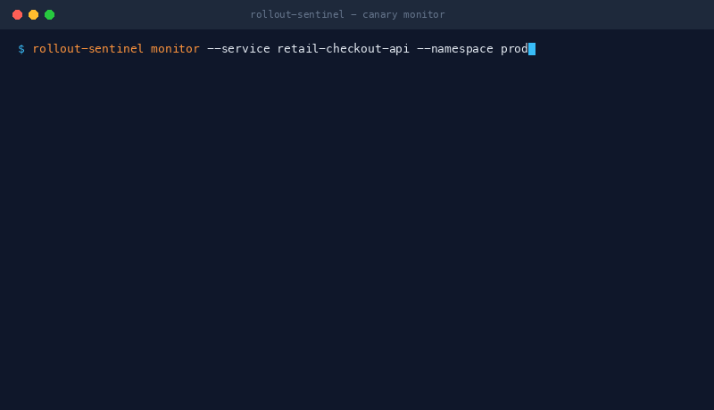

# rollout-sentinel


> Automated canary gate verification and sub-minute incident triage.

Progressive delivery and canary health evaluation CLI for Kubernetes and Prometheus. Evaluates error budgets, p99 latency SLA gates, and container resource saturation during traffic step cutovers, triggering automated rollbacks upon consecutive SLO breaches.



---

## What it does

- Evaluates live canary metric snapshots against baseline pods across 5 distinct SLO quality gates: HTTP 5xx error rate, relative error degradation, p99 latency threshold, latency drift percentage, and cgroup CPU/memory saturation.
- Halts traffic promotion and triggers automated rollback within 2 minutes of consecutive SLA breaches.
- Deterministic fast-path failure classifier for exit code 137 OOMKilled, CrashLoopBackOff, ImagePullBackOff, and probe timeouts (&lt; 0.4ms execution latency).
- LLM incident triage engine that correlates Kubernetes pod events, container stderr logs, and Prometheus metrics diffs to generate actionable hypotheses and immediate runbook remediation steps.

---

## What it looks like in practice

```text
$ rollout-sentinel monitor --service retail-checkout-api --namespace production

--- [STEP 1/3] Evaluating canary at 10% traffic weight ---
Status Verdict:  [PASS]
Action:          ADVANCE_TRAFFIC_STEP -> Promoting canary to 20%
Summary:         All 5 SLO gates passed at 10% traffic weight.
Quality Gates (5 evaluated):
  [PASS] ErrorRateGate                -> Canary 5xx rate: 0.012% (Max allowed: 0.500%)
  [PASS] P99LatencyGate               -> Canary p99 latency: 142.4ms (Max SLA: 500.0ms)
  [PASS] LatencyDriftGate             -> Canary latency drift: +4.2% compared to baseline (142.4ms vs 136.6ms)
  [PASS] CpuSaturationGate            -> Canary CPU saturation: 32.1% (Threshold: 80.0%)
  [PASS] MemorySaturationGate         -> Canary memory saturation: 48.2% (Threshold: 85.0%)

--- [STEP 2/3] Evaluating canary at 20% traffic weight ---
Status Verdict:  [BREACH]
Action:          TRIGGER_AUTOMATED_ROLLBACK -> Executing kubectl rollout undo (MTTR: 2m)
Summary:         SLO Breach: One or more critical quality gates failed at 20% traffic weight.
Quality Gates (5 evaluated):
  [FAIL] ErrorRateGate                -> Canary 5xx rate: 2.418% (Max allowed: 0.500%)
  [FAIL] RelativeErrorDegradationGate -> Canary error rate elevated by +2.404% over baseline (2.418% vs 0.014%)
  [PASS] P99LatencyGate               -> Canary p99 latency: 188.0ms (Max SLA: 500.0ms)
  [PASS] LatencyDriftGate             -> Canary latency drift: +18.4% compared to baseline (188.0ms vs 158.8ms)
  [PASS] MemorySaturationGate         -> Canary memory saturation: 62.4% (Threshold: 85.0%)

================================================================================
                  ROLLOUT-SENTINEL: POD FAILURE TRIAGE ENGINE                   
================================================================================
Target Pod:      retail-checkout-api-canary-7f8d-x9
Failure Reason:  OOMKilled (Exit Code: 137)

[1] DETERMINISTIC RULE CLASSIFIER:
    Category:       OOMKilled
    Confidence:     99.0%
    Root Cause:     Container exceeded cgroup memory limit (Exit Code 137).
    Remediation:    Inspect memory profile, increase pod memory limits, and check for heap buffer leaks.

[2] AI / LLM ROOT-CAUSE SYNTHESIS:
    Title:          Production Incident: retail-checkout-api Canary OOM Spike
    Summary:        Canary pod terminated via SIGKILL after exceeding cgroup memory boundary during 20% traffic ramp.
    Hypothesis:     Synchronous telemetry buffer accumulation in request handler causing unbounded heap growth under load.
    Rollback Recom: true
    Immediate Actions:
      - Confirm automated rollback execution to baseline version v2.13.9.
      - Profile heap allocation under load in staging environment.
      - Implement backpressure and bound in-memory event queues.
================================================================================
```

---

## Architecture

```text
                 +-----------------------------------------------+
                 |              Kubernetes Ingress               |
                 |     [Traffic Split: 90% Baseline / 10% Canary]|
                 +-----------------------+-----------------------+
                                         |
                     +-------------------+-------------------+
                     |                                       |
                     v                                       v
         +-----------------------+               +-----------------------+
         | Baseline Deployment   |               |   Canary Deployment   |
         | (v2.13.9 - 10 Pods)   |               |   (v2.14.0 - 2 Pods)  |
         +-----------+-----------+               +-----------+-----------+
                     |                                       |
                     +-------------------+-------------------+
                                         | (PromQL Scrape)
                                         v
                         +-------------------------------+
                         |      Prometheus Telemetry     |
                         |   (Error Rate, P99, CPU/Mem)  |
                         +---------------+---------------+
                                         |
                                         v
                   +---------------------------------------------+
                   |              rollout-sentinel               |
                   | +-----------------------------------------+ |
                   | |  Evaluator: 5-Gate SLO Verification     | |
                   | +-----------------------------------------+ |
                   | |  Triage: Fast-path Classifier + LLM     | |
                   | +-----------------------------------------+ |
                   +---------------------+-----------------------+
                                         |
                     +-------------------+-------------------+
                     | (Verdict == PASS)                     | (Verdict == BREACH)
                     v                                       v
         +-----------------------+               +-----------------------+
         | Advance Traffic Step  |               | Trigger Auto Rollback |
         |   (10% -> 20% -> 50%) |               | & Emit Triage Summary |
         +-----------------------+               +-----------------------+
```

---

## CLI Usage

### 1. One-Shot Canary Verification
```bash
rollout-sentinel check --service retail-checkout-api --namespace production --weight 10
```

### 2. Progressive Deployment Monitoring Loop
```bash
rollout-sentinel monitor --service retail-checkout-api --namespace production --steps 3
```

### 3. Automated Pod Failure Triage
```bash
rollout-sentinel triage --pod retail-checkout-api-canary-7f8d-x9 --reason OOMKilled --exit-code 137
```

---

## Docker Container

Multi-stage build with non-root security context:

```bash
# Build image
docker build -t ghcr.io/gerardrecinto/rollout-sentinel:v1.0.0 .

# Run check in container
docker run --rm ghcr.io/gerardrecinto/rollout-sentinel:v1.0.0 check --service checkout-api --namespace prod --weight 20
```

---

## ArgoCD and Argo Rollouts GitOps

Manifests are located in `deploy/`:

- `deploy/argocd/application.yaml`: ArgoCD Application CRD with automated self-healing and pruning.
- `deploy/argo-rollouts/analysis-template.yaml`: AnalysisTemplate running `rollout-sentinel check` at each traffic step.
- `deploy/argo-rollouts/rollout.yaml`: Argo Rollout with canary step progression (10% -> 20% -> 50% -> 100%).

Apply to cluster:
```bash
kubectl apply -f deploy/argocd/application.yaml
```

---

## Benchmarks

- **Canary Step Evaluation Overhead:** &lt; 12ms (concurrent metric fetch + multi-gate evaluation)
- **Deterministic Rule Classifier:** &lt; 0.4ms execution latency
- **Memory Footprint:** &lt; 18MB RSS at peak monitoring throughput

---

## Installation

### Download binary (macOS)

Download the latest release tarball from [Releases](https://github.com/gerardrecinto/rollout-sentinel/releases):

```bash
curl -L https://github.com/gerardrecinto/rollout-sentinel/releases/latest/download/rollout-sentinel_v1.0.0_darwin_arm64.tar.gz -o rollout-sentinel.tar.gz
tar -xzf rollout-sentinel.tar.gz
chmod +x rollout-sentinel-darwin-arm64
mv rollout-sentinel-darwin-arm64 /usr/local/bin/rollout-sentinel
```

### Build from source

```bash
git clone https://github.com/gerardrecinto/rollout-sentinel.git
cd rollout-sentinel
go build -ldflags="-s -w" -o bin/rollout-sentinel ./cmd/sentinel
```

---

## Author

Gerard Recinto: [GitHub](https://github.com/gerardrecinto) | [LinkedIn](https://linkedin.com/in/gerardrecinto)
